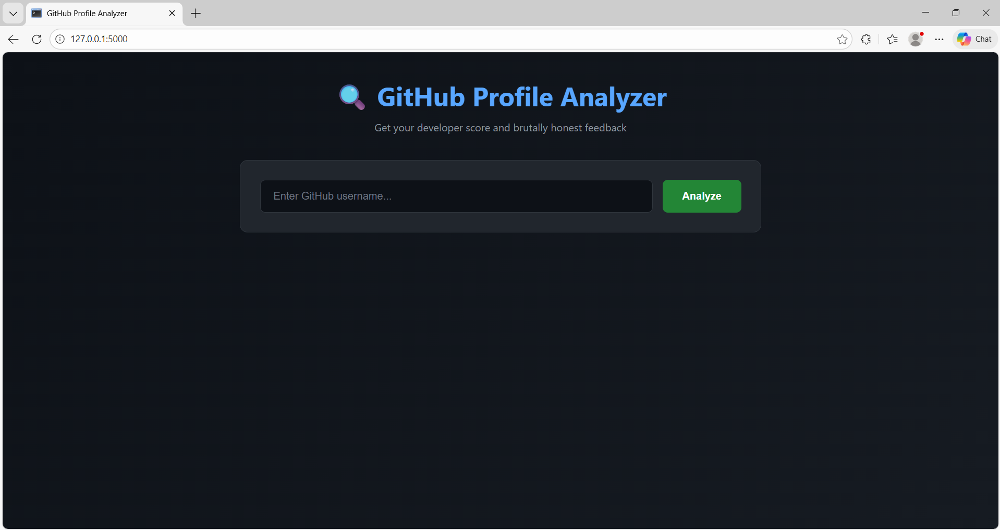

# 🔍 GitHub Profile Analyzer

Analyze any GitHub profile and get a developer score + brutally honest roast.


## Live Demo

🚀 [Try it here](https://your-app-name.onrender.com)

## Features

- **Developer Score** — Get rated 0-100 based on your GitHub activity
- **Profile Stats** — Repos, stars, forks, followers at a glance
- **Language Breakdown** — See all languages you've used
- **The Roast** — Brutally honest feedback about your profile

## Screenshots



## How the Score Works

| Criteria | Points |
|----------|--------|
| Has bio | +20 |
| 5+ repositories | +10 |
| 10+ followers | +10 |
| 3+ languages | +20 |
| 10+ following | +20 |
| 10+ total stars | +20 |

## Run Locally

1. **Clone the repo**
   ```bash
   git clone https://github.com/sara-iskandar/github-profile-analyzer.git
   cd github-profile-analyzer
   ```

2. **Create virtual environment**
   ```bash
   python -m venv venv
   source venv/bin/activate  # Windows: venv\Scripts\activate
   ```

3. **Install dependencies**
   ```bash
   pip install -r requirements.txt
   ```

4. **Run the app**
   ```bash
   python app.py
   ```

5. **Open** `http://127.0.0.1:5000`

## Tech Stack

- Python
- Flask
- GitHub REST API
- HTML/CSS

## Deployment

Deployed on [Render](https://render.com) (free tier).

To deploy your own:
1. Fork this repo
2. Connect to Render
3. Set build command: `pip install -r requirements.txt`
4. Set start command: `gunicorn app:app`

## API Reference

Uses the public [GitHub REST API](https://docs.github.com/en/rest):
- `GET /users/{username}` — Profile data
- `GET /users/{username}/repos` — Repository data

No API key required for basic usage.

## Contributing

Pull requests welcome! Ideas for improvement:
- [ ] Compare two profiles
- [ ] Shareable image cards
- [ ] Commit activity analysis
- [ ] Repository quality scoring

## License

MIT

## Author

**Sara** — Software Engineer transitioning to AI/ML

[LinkedIn](https://linkedin.com/in/sara-iskandar) • [GitHub](https://github.com/sara-iskandar)

---

⭐ If you found this useful, give it a star!
